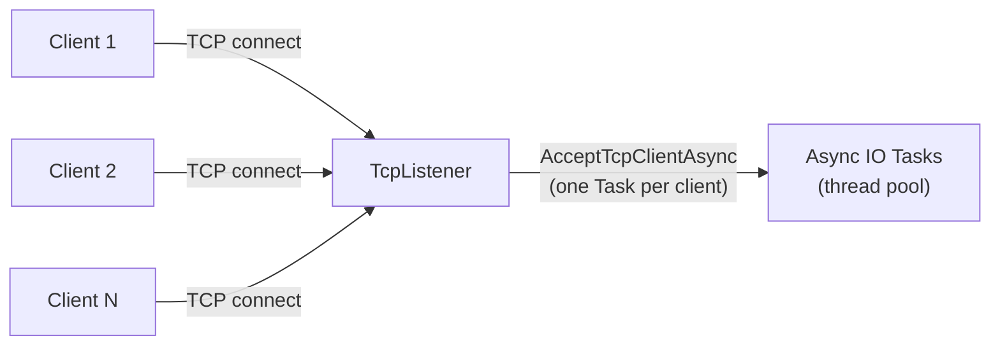
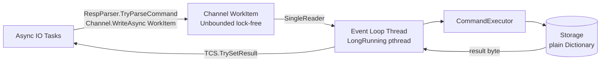
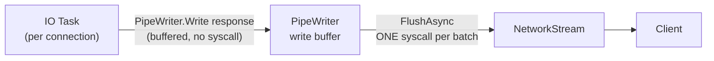
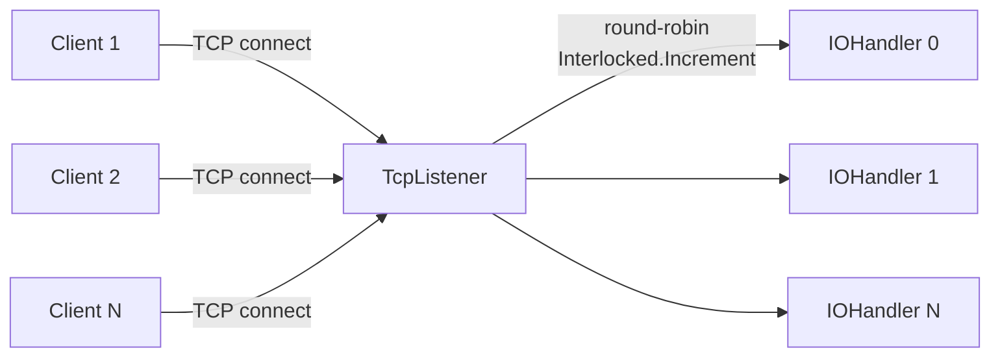
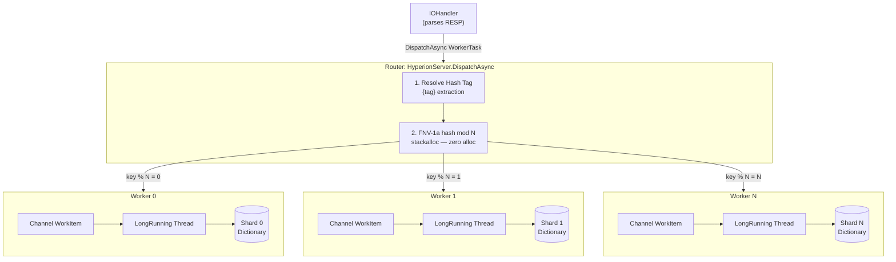
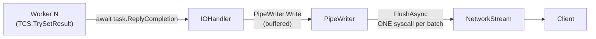

# Hyperion

A Redis-compatible in-memory database, built from scratch in C#/.NET 10.

I started this project to deeply understand how Redis works under the hood — not just the API, but the internals: how it parses the wire protocol, manages key expiry, how a Skip List enables O(log N) ranked queries, and why single-threaded servers can outperform naively multi-threaded ones.

The multi-threaded mode uses a **share-nothing architecture** — each worker thread owns a private data shard with no locks on the hot path. The single-threaded mode uses a **true event-loop** design: one dedicated OS thread owns all command execution, fed by async IO handlers through a lock-free channel.

Hyperion speaks standard RESP2, so you can connect with any `redis-cli` or Redis client library.

---

## What's Implemented

**Protocol** — Hand-written RESP2 parser, encoder, and decoder. Zero-copy parsing via `System.IO.Pipelines`.

**Data Structures** — All implemented from scratch, following the same algorithms used in Redis's source code:
- **Dict** — Key-value store with separate TTL tracking and coarse-clock LRU timestamps
- **Skip List** — Probabilistic sorted structure with span tracking for O(log N) rank queries (same as Redis's `zskiplist`)
- **ZSet** — Sorted Set using Dict + Skip List together (the classic Redis dual-structure trick)
- **Bloom Filter** — Probabilistic membership test with optimal sizing via Kirsch-Mitzenmacker double hashing
- **Count-Min Sketch** — Frequency estimation with configurable error/probability bounds
- **Eviction Pool** — Sampling-based approximate LRU (Redis's approach of sampling keys instead of maintaining a full LRU list)

**Commands:**

| Category | Commands |
|---|---|
| Connection | `PING`, `INFO` |
| String | `SET`, `GET`, `DEL`, `TTL`, `INCR`, `DECR` |
| Hash | `HSET`, `HGET`, `HDEL`, `HGETALL` |
| List | `LPUSH`, `RPUSH`, `LPOP`, `RPOP`, `LRANGE` |
| Set | `SADD`, `SREM`, `SISMEMBER`, `SMEMBERS` |
| Sorted Set | `ZADD`, `ZREM`, `ZSCORE`, `ZRANK`, `ZRANGE` |
| Bloom Filter | `BF.RESERVE`, `BF.MADD`, `BF.EXISTS` |
| Count-Min Sketch | `CMS.INITBYDIM`, `CMS.INITBYPROB`, `CMS.INCRBY`, `CMS.QUERY` |

**Server modes:**
- **Single-threaded** — One dedicated OS thread owns all command execution. Async IO handlers feed commands through a lock-free `Channel`. Responses are batched with `PipeWriter` — one flush per read batch.
- **Multi-threaded (share-nothing)** — N worker threads each own a private storage shard. IO Handlers route commands via FNV-1a hash, collect results and batch-flush responses with `PipeWriter`.

**Key expiry** — Both lazy (check on access) and active (background sweep sampling and deleting expired keys).

---

## Architecture

### Single-Thread Mode

The goal is simple: **one thread, zero locks, maximum cache locality.**

#### 1. Connection Layer
The `TcpListener` accepts connections. For each client, a lightweight `async Task` (managed by the .NET thread pool) handles IO — reading bytes from the socket using `PipeReader`.



#### 2. Execution Layer
Each IO task parses complete RESP commands from its `PipeReader` and enqueues a `WorkItem` to a shared lock-free `Channel<WorkItem>`. A single dedicated OS thread (`LongRunning`) consumes the channel one item at a time and executes every command against the `CommandExecutor` — no synchronization needed because only this thread ever touches the data.



#### 3. Response Layer
Once the IO task receives the result from the `TaskCompletionSource`, it calls `PipeWriter.Write()` — which buffers the bytes locally. After all commands in the current read batch are processed, a **single** `PipeWriter.FlushAsync()` sends them all in one syscall.



---

### Multi-Thread Mode (Share-Nothing)

The goal: **scale across CPU cores with zero cross-thread data sharing.**

#### 1. Connection Layer
`HyperionServer` accepts connections and distributes them to IO Handlers in **round-robin**. Each `IOHandler` is an async loop that reads from its assigned clients using `PipeReader`.



#### 2. Routing & Execution Layer
Each `IOHandler` parses commands and calls `HyperionServer.DispatchAsync()`. The dispatcher extracts the key, resolves any Hash Tag (`{tag}` syntax), runs FNV-1a hash, and enqueues the `WorkerTask` to the matching Worker's `Channel`. Each Worker is a `LongRunning` thread with its own **private** `Storage` — no locking ever needed.



**Special case — multi-key `DEL`:** If keys map to different shards, the dispatcher does a **Scatter-Gather**: splits the command into per-shard sub-tasks, dispatches them all concurrently, awaits all results, then sums the deleted count and resolves the original `TaskCompletionSource`.

#### 3. Response Layer
Same as single-thread: `IOHandler` collects all `TCS` results from the current read batch, writes them into a `PipeWriter` buffer, and flushes once.



---

## Getting Started

Requirements: [.NET 10 SDK](https://dotnet.microsoft.com/en-us/download/dotnet/10.0)

```bash
git clone https://github.com/ductai202/Hyperion.git
cd Hyperion

# Multi-threaded mode (default)
dotnet run --project src/Hyperion.Server -c Release -- --port 3000

# Single-threaded mode
dotnet run --project src/Hyperion.Server -c Release -- --port 3000 --mode single
```

For maximum performance, publish as a self-contained binary:

```bash
dotnet publish src/Hyperion.Server/Hyperion.Server.csproj \
  -c Release -r linux-x64 --self-contained true -o ./publish

./publish/Hyperion.Server --port 3000 --mode multi
```

Then connect:

```bash
redis-cli -p 3000

127.0.0.1:3000> SET hello world
OK
127.0.0.1:3000> GET hello
"world"
127.0.0.1:3000> ZADD leaderboard 100 "alice" 200 "bob"
(integer) 2
127.0.0.1:3000> ZRANK leaderboard "alice"
(integer) 0
```

---

## Benchmark

Tested on WSL2 (Ubuntu) using `redis-benchmark` with 500 clients, 1M requests, 1M random keys.

```bash
redis-benchmark -n 1000000 -t set,get -c 500 -h 127.0.0.1 -p 3000 -r 1000000 --threads 3 --csv
```

| Server | SET (req/s) | GET (req/s) |
|---|---|---|
| Redis 7.4.1 | ~142,000 | ~136,000 |
| **Hyperion Single-Thread** | **~117,000** | **~110,000** |
| **Hyperion Multi-Thread** | **~107,000** | **~113,000** |

Both modes exceed **100,000 req/s** and reach **~80% of native Redis** throughput on the same hardware.

Full methodology, latency breakdown, pain points, and delay-workload analysis in [doc/Benchmark.md](doc/Benchmark.md).

---

## What's Next

- [ ] Redis Cluster protocol
- [ ] RDB persistence
- [ ] `ArrayPool<byte>` for response buffers to reduce GC pressure
- [ ] Pre-cached static RESP responses (`+OK`, `:1`, `$-1`) to eliminate hot-path encoding
