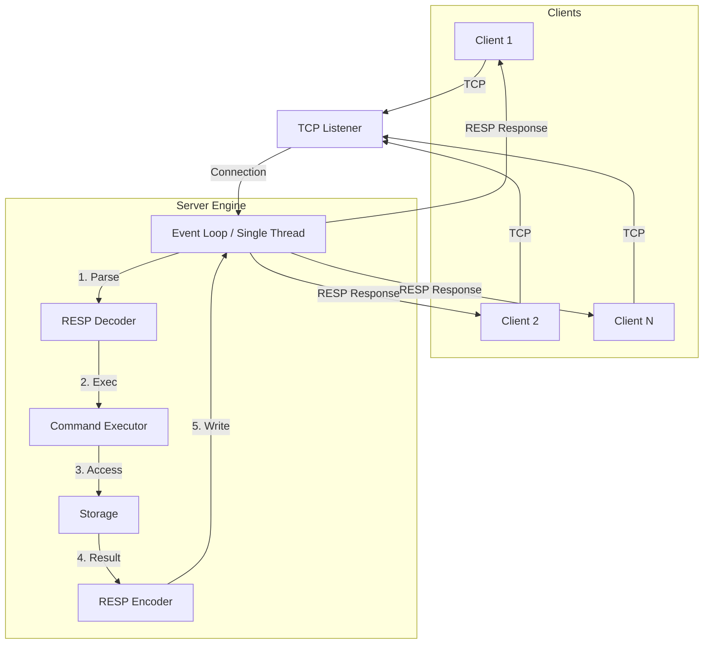
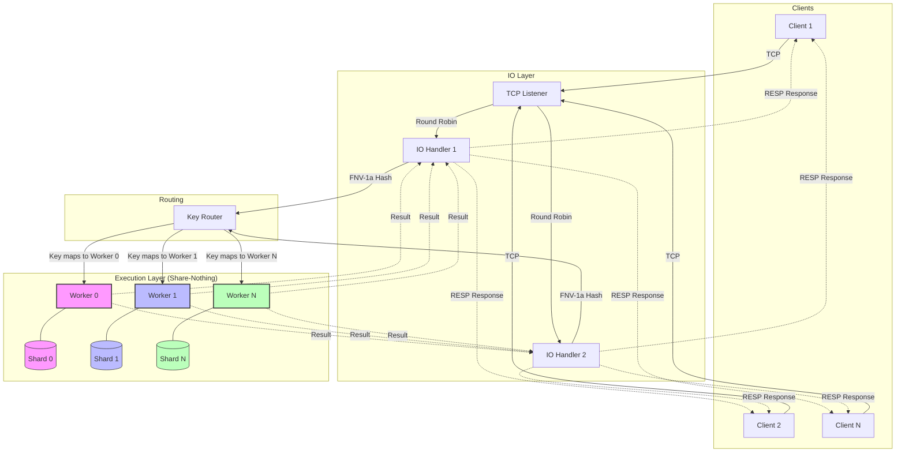

# Hyperion

A Redis-compatible in-memory database, built from scratch in C#/.NET 10.

I started this project to understand how Redis actually works under the hood — not just the API, but the internals: how it parses the wire protocol, how it manages key expiry, how a Skip List enables O(log N) ranked queries, and why Bloom Filters use `ln(2)²` in their sizing formula.

The multi-threaded mode is inspired by [DragonflyDB](https://www.dragonflydb.io/)'s share-nothing architecture — each worker thread owns a private data shard, so there are no locks on the hot path.

Hyperion speaks standard RESP2, so you can connect with any `redis-cli` or Redis client library.

---

## What's implemented

**Protocol** — Hand-written RESP2 parser, encoder, and decoder. Zero-copy parsing via `System.IO.Pipelines`.

**Data Structures** — All implemented from scratch, following the same algorithms used in Redis's source code:
- **Dict** — Key-value store with separate TTL tracking and LRU timestamps (mirrors Redis's `redisDb` with its dual-dictionary design)
- **Skip List** — Probabilistic sorted structure with span tracking for O(log N) rank queries (same as Redis's `zskiplist`)
- **ZSet** — Sorted Set using Dict + Skip List together (the classic Redis dual-structure trick)
- **Bloom Filter** — Probabilistic membership test with optimal sizing via Kirsch-Mitzenmacker double hashing
- **Count-Min Sketch** — Frequency estimation with configurable error/probability bounds
- **Eviction Pool** — Sampling-based approximate LRU (Redis's approach of sampling 5 keys instead of maintaining a full LRU list)

**Commands:**

| Category | Commands |
|---|---|
| Connection | `PING`, `INFO` |
| String | `SET`, `GET`, `DEL`, `TTL`, `INCR`, `DECR` |
| Hash | `HSET`, `HGET`, `HDEL`, `HGETALL` |
| List | `LPUSH`, `RPUSH`, `LPOP`, `RPOP`, `LRANGE` |
| Set | `SADD`, `SREM`, `SISMEMBER`, `SMEMBERS` |
| Sorted Set | `ZADD`, `ZREM`, `ZSCORE`, `ZRANK`, `ZRANGE` |
| Bloom Filter | `BF.RESERVE`, `BF.MADD`, `BF.EXISTS` |
| Count-Min Sketch | `CMS.INITBYDIM`, `CMS.INITBYPROB`, `CMS.INCRBY`, `CMS.QUERY` |

**Server modes:**
- **Single-threaded** — Classic Redis-style. One thread handles all IO and execution.
- **Multi-threaded (share-nothing)** — N worker threads, each with its own storage shard. Keys are routed via FNV-1a hash. No locks needed.

**Key expiry** — Both lazy (check on access) and active (background sweep that samples and deletes expired keys).

---

## Architecture

### Single-thread mode

Classic and simple: one event loop handles everything from reading the socket to executing the command and writing back. No locks, no context switching, just pure speed.



### Multi-thread mode (Share-nothing)

Inspired by DragonflyDB. We split the workload into **IO Handlers** and **Workers**. Each worker owns its own data shard, so they never have to wait for each other.



On a machine with 8 logical cores, Hyperion automatically spins up 8 workers and 4 IO handlers. Since a given key always maps to the same worker via **FNV-1a hashing**, the storage shards are completely isolated. 

**FNV-1a (Fowler-Noll-Vo)** is used for partitioning because it is a non-cryptographic algorithm that is exceptionally fast and provides high dispersion for short strings (the most common type of Redis keys). This ensures traffic is balanced evenly across all shards with minimal overhead.

**Multi-Key Commands & Hash Tags**
To handle commands that span multiple keys (like `DEL key1 key2`), Hyperion implements a **Scatter-Gather** routing engine inspired by Dragonfly. If keys map to different shards, the orchestrator splits the command into sub-tasks, dispatches them concurrently, and aggregates results. To avoid cross-shard overhead, Hyperion supports **Redis Cluster Hash Tags** (e.g., `{user:1}:name` and `{user:1}:age` route to the same shard).

**References:**
- [Dragonfly Transactions & Scatter-Gather Logic](https://www.dragonflydb.io/blog/transactions-in-dragonfly)
- [Dragonfly FAQ: Shared-Nothing & Vertical Scaling](https://www.dragonflydb.io/docs/about/faq)
- [VLL Algorithm: The research behind Dragonfly's multi-key coordination](https://www.cs.umd.edu/~abadi/papers/vldbj-vll.pdf)

No mutexes, no spinlocks, no contention.

---

## Getting started

Requirements: [.NET 10 SDK](https://dotnet.microsoft.com/en-us/download/dotnet/10.0)

```bash
git clone https://github.com/ductai202/Hyperion.git
cd Hyperion

# Multi-threaded mode (default)
dotnet run --project src/Hyperion.Server -- --port 3000

# Single-threaded mode
dotnet run --project src/Hyperion.Server -- --port 3000 --mode single
```

Then connect:

```bash
redis-cli -p 3000

127.0.0.1:3000> SET hello world
OK
127.0.0.1:3000> GET hello
"world"
127.0.0.1:3000> ZADD leaderboard 100 "alice" 200 "bob"
(integer) 2
127.0.0.1:3000> ZRANK leaderboard "alice"
(integer) 0
```


---

## Benchmark

### Benchmark (WSL)
Tested with `redis-benchmark` (500 clients, 1M requests, 1M keys) on an 8-core machine.

| Environment | Mode | SET (req/s) | GET (req/s) |
|---|---|---|---|
| **WSL (Ubuntu)** | Origin Redis 7.4.1 | 78,186 | 117,412 |
| **WSL (Ubuntu)** | Hyperion Single-Thread | 45,785 | 43,425 |
| **WSL (Ubuntu)** | **Hyperion Multi-Thread** | **94,679** | **113,856** |

**Why Multi-Thread Wins Under Load:**
While single-thread mode is fast, the true power of the share-nothing architecture shines when commands are delayed. By injecting a synthetic 100µs delay into execution, we see:

| Environment | Mode (100µs delay) | GET (req/s) |
|---|---|---|
| **WSL (Ubuntu)** | Hyperion Single-Thread | 36,995 |
| **WSL (Ubuntu)** | **Hyperion Multi-Thread** | **106,929** (2.89x faster) |

When one command artificially blocks, the share-nothing design prevents other workers from being blocked, ensuring high throughput even under contention.

Full details in [doc/Benchmark.md](doc/Benchmark.md).


## What's next

- [ ] Redis Cluster protocol
- [ ] RDB persistence
